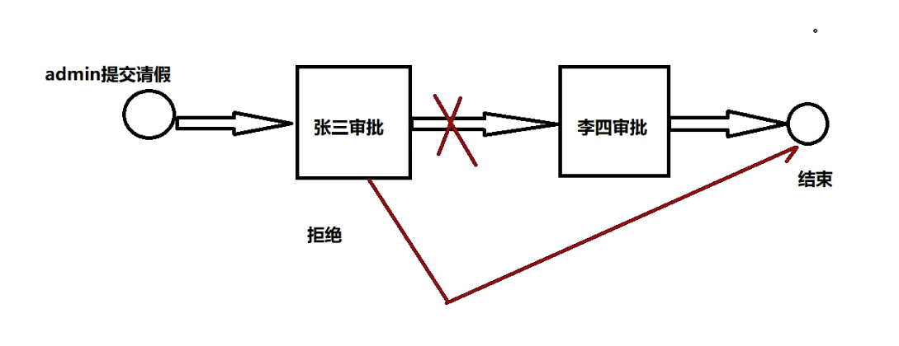

Activiti使用问题
1、使用zip压缩文件部署流程定义
命名特点
zip文件名称：需要<process id ="qingjia"> 一致 即为qingjia.zip
发起审批中-驳回操作（如第一个审批人拒绝审批则终止流程）
In OaProcessServiceImpl endTask方法

内网穿透工具-微信公众号直接访问到电脑的本地接口

前端项目在本地frontPage\cjh-oa(后期的微信公众号部分未完成)-微信公众号weixin-java-mp-4.1.0导包失败